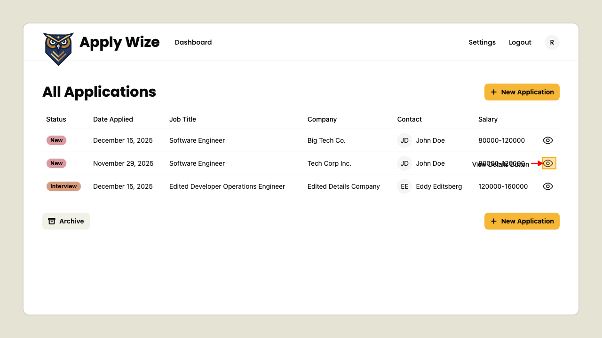

# Applications Information

## Displays application details

On the Application page, 
to view a specific application's details; clicking the View Detail button (button with the eye icon).

This will navigate to the Application Detail page.

            ### The Application Detail page

            This page shows the details for a single job application, including its status, metadata, and related actions.

            You can:
            - Navigate back using breadcrumbs
            
- See the job title, company, and application status
            
- Button linking to the original job posting
            
- Main section describing the role
            
- Compensation showing the salary range
            
- Contacts section for related contacts
            
- Edit to update the application details
            
- Delete to remove the application
            

