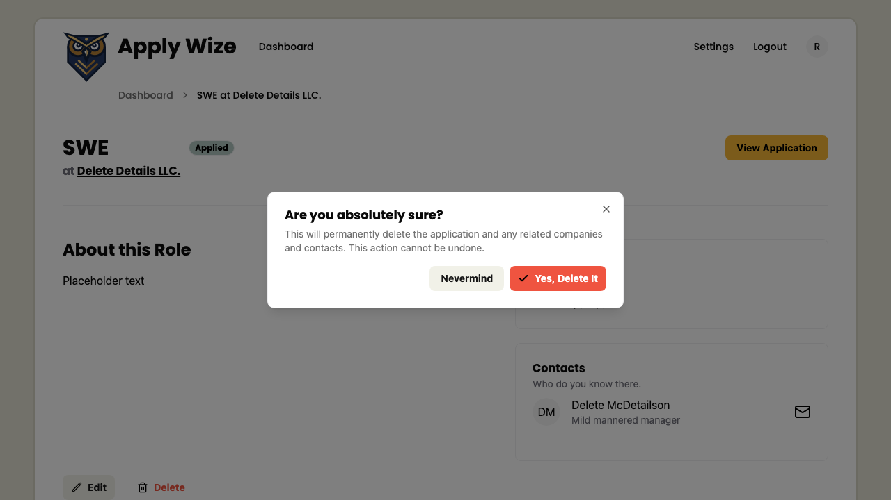

# How to delete an application

## On the application detail page

On the Application Detail page, 
click the Delete button to open a confirmation dialog.

In the dialog, you can either cancel or confirm the deletion.

Clicking 'Nevermind' will close the dialog without deleting the application.
Clicking 'Yes, Delete It' will remove the application and redirect you to the dashboard.

