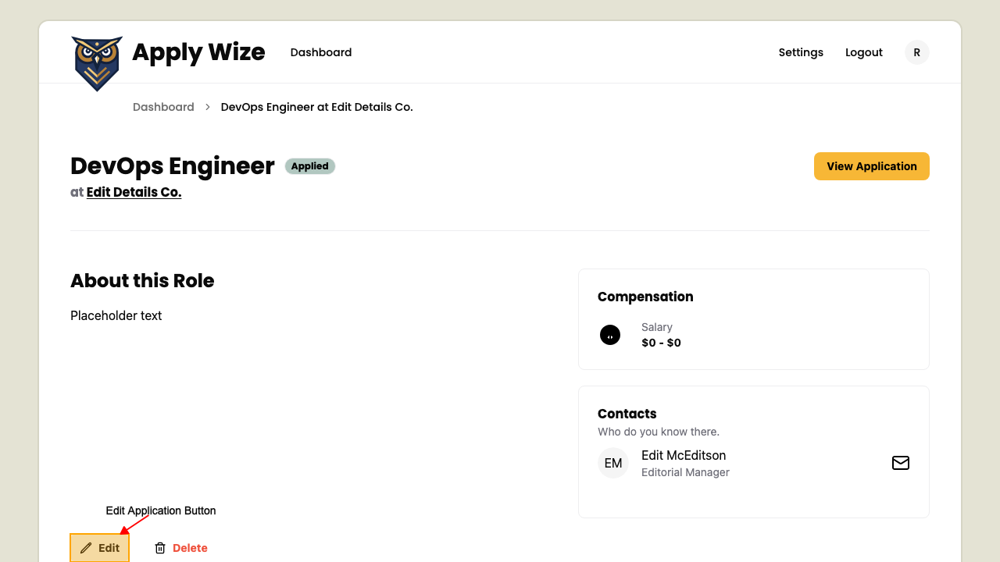

# How to edit an application

## On the application detail page

On the Application Detail page, 
click the Edit link to navigate to the edit application page.

On the top of the Edit Application page, is a breadcrumb navigation to navigate back to previous pages.
### Fields you can edit on the application

          You can modify the following fields:
          - Company Name
          
- Job Title
          
- Job Description / Requirements
          
- Salary Range
          
- Application URL
          
- Application submission date
          
- Application Status
          
- Contacts
          
### Edit Application page actions

          In the footer of the Edit Application form, there are two main actions you can take:
          - **Cancel**: Clicking this will discard any changes you've made and return you to the Application Detail page.
          
- **Update**: Clicking this will save all the modifications you've made to the application and redirect you back to the Application Detail page, where you can see the updated information.
          

