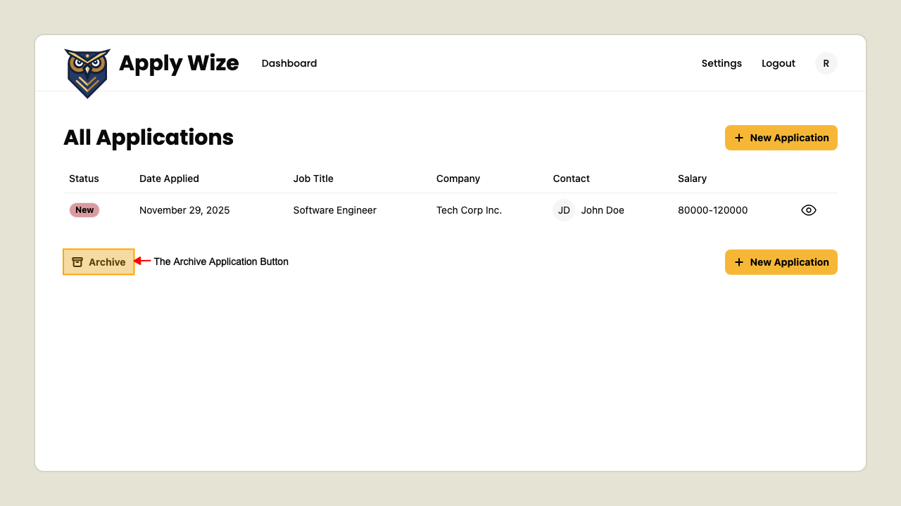

# Filtering Applications

## Display Archived Applications

On the Applications page 
the **Archive Application** button is visible. 

Clicking the button shows archived applications in the table.

To switch back to active applications, click the 'Active' button.

