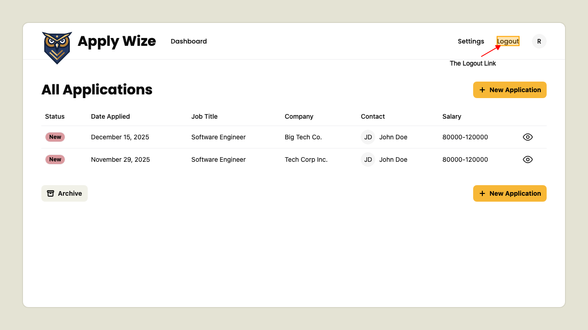

# How to logout

## Logout link

On a logged in page 
the Logout link is visible in the header.

Clicking the Logout link logs the user out and takes them to the login page. 
The user is now logged out ending their current session.

