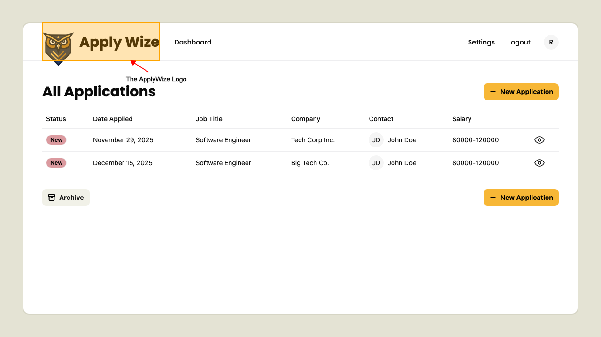
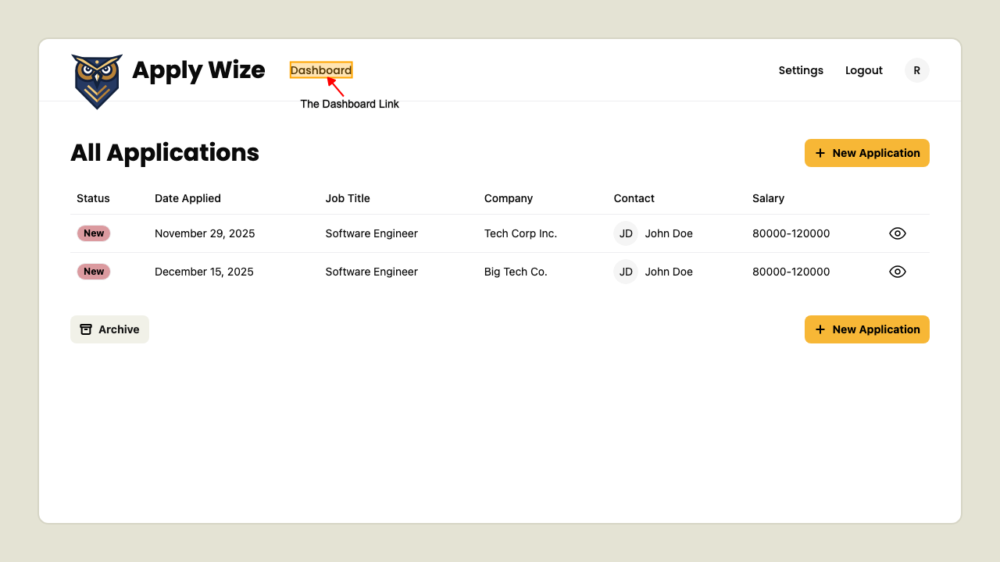
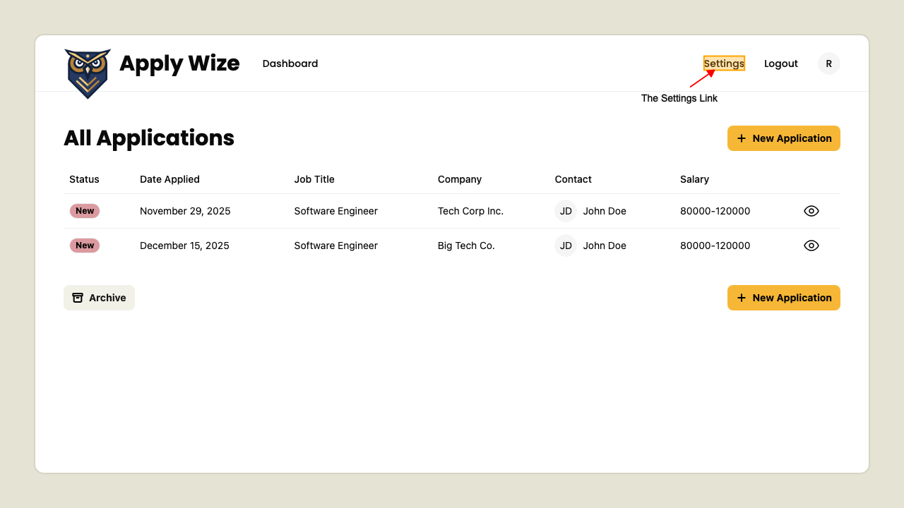
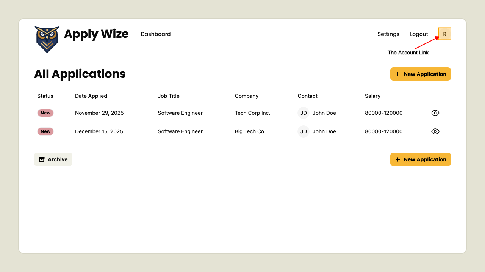

# The Internal Page Header

## The Logo

On a logged in page 
the logo is visible in the header.

Clicking the logo takes you to the Home page.

## Dashboard link

On a logged in page 
the Dashboard link is visible in the header.

Clicking the Dashboard link takes you to the Dashboard page.

## Settings link

On a logged in page 
the Settings link is visible in the header.

Clicking the Settings link takes you to the Settings page.

## Account link

On a logged in page 
the Account link is visible in the header.

Clicking the Account link takes you to the Account page.

