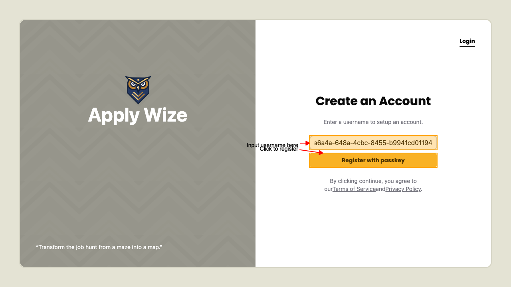
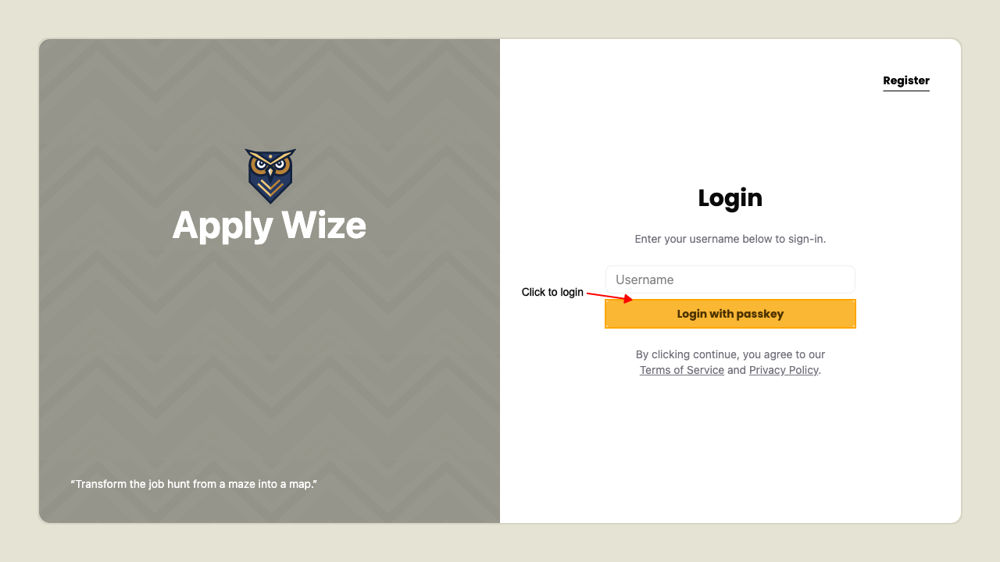
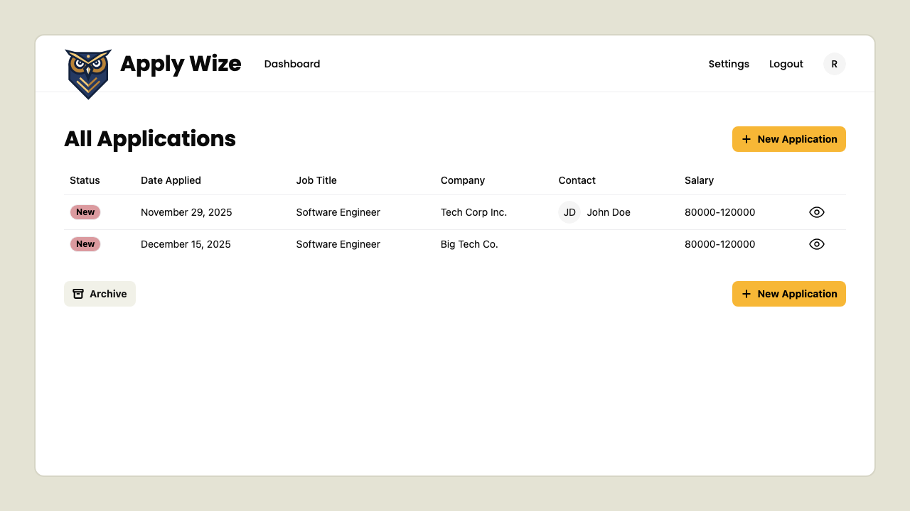

# Authentication Flow

## Register a new user

We support [Passkeys](https://docs.github.com/en/authentication/authenticating-with-a-passkey/about-passkeys) by [WebAuthn](https://en.wikipedia.org/wiki/WebAuthn).

To get started with registration, goto the sign up page at `/auth/signup`.

Filling out the registration form and 
submitting the registration form. Then follow the passkey registration prompt by your browser.

On successful registration you will be redirect to login page.

## Login with existing user

While on the login page at `/auth/login`.

Clicking the login button and following the passkey prompt by your browser.

On successful login you will be taken to the applications page.

