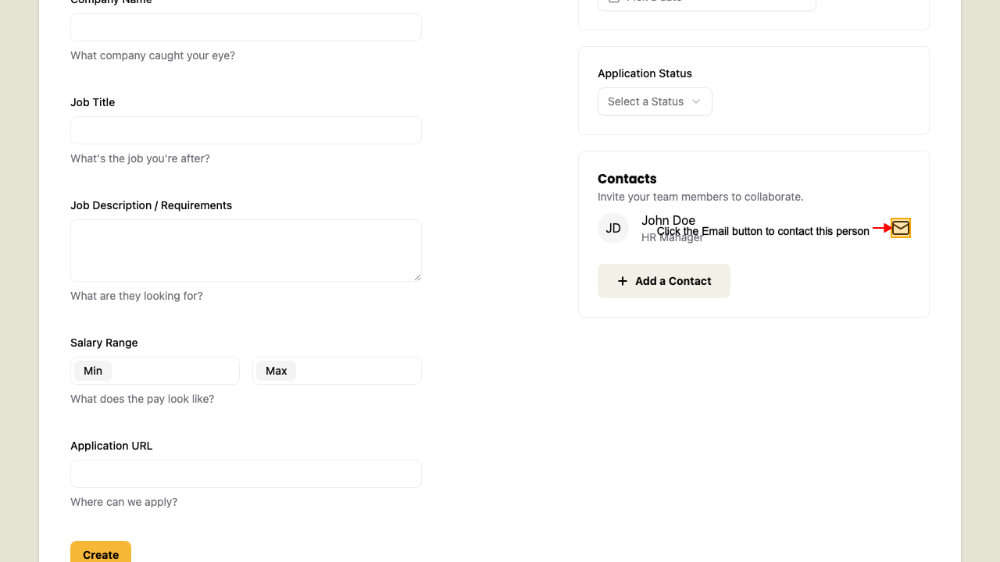
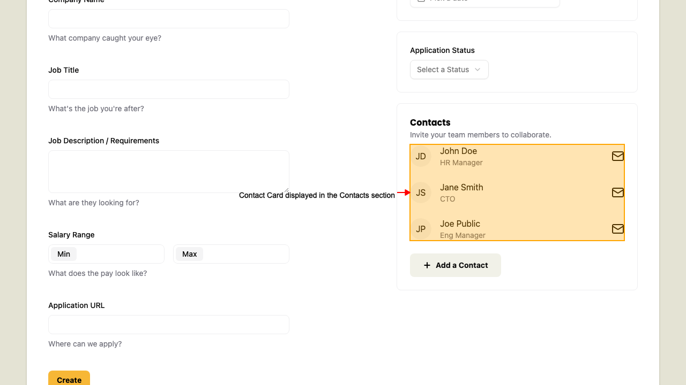
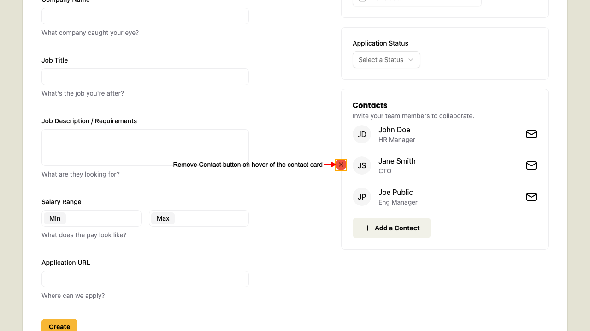
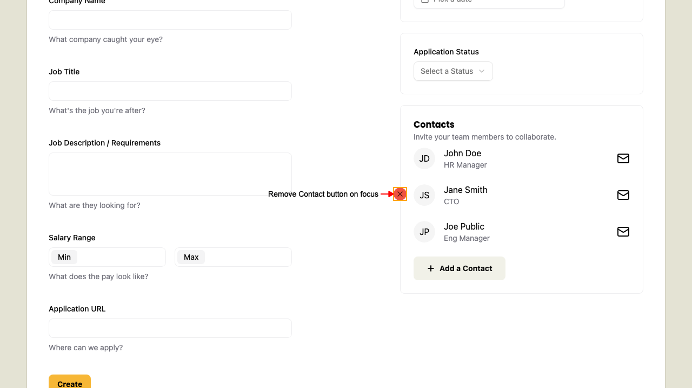

# Contact Card

## Contact Card Email button

When on the New Application page, 
after you added a contact. The contact card displays.
Click the Email button on the contact card should open your email client.

## Remove a Contact

When on the New Application page, 
after you added a contact. The contact card displays.

Hover over the contact card to reveal the Remove button.

Alternatively, focus on the Remove button to reveal it too.

Click the Remove button to delete the contact from the application form.

