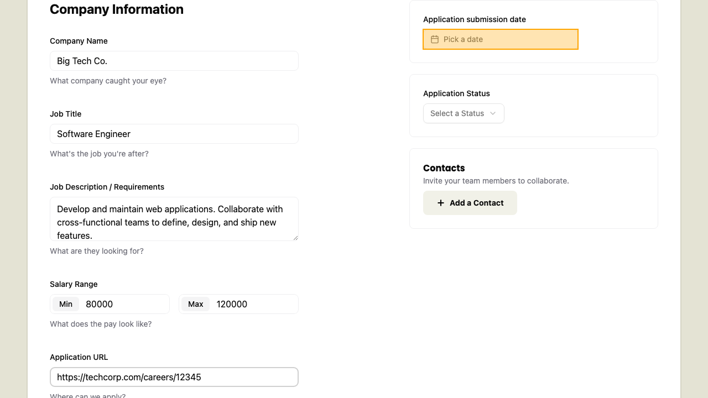
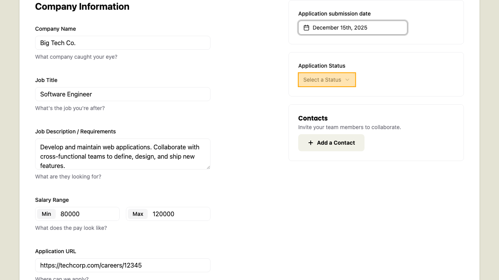
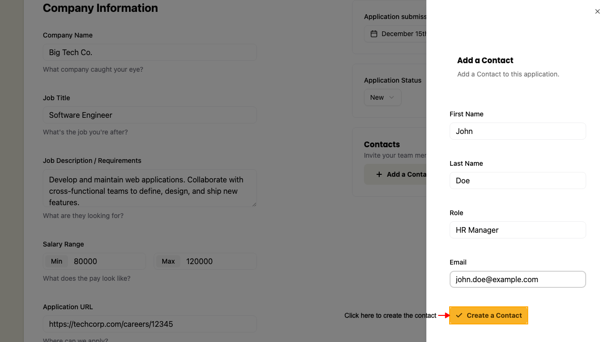
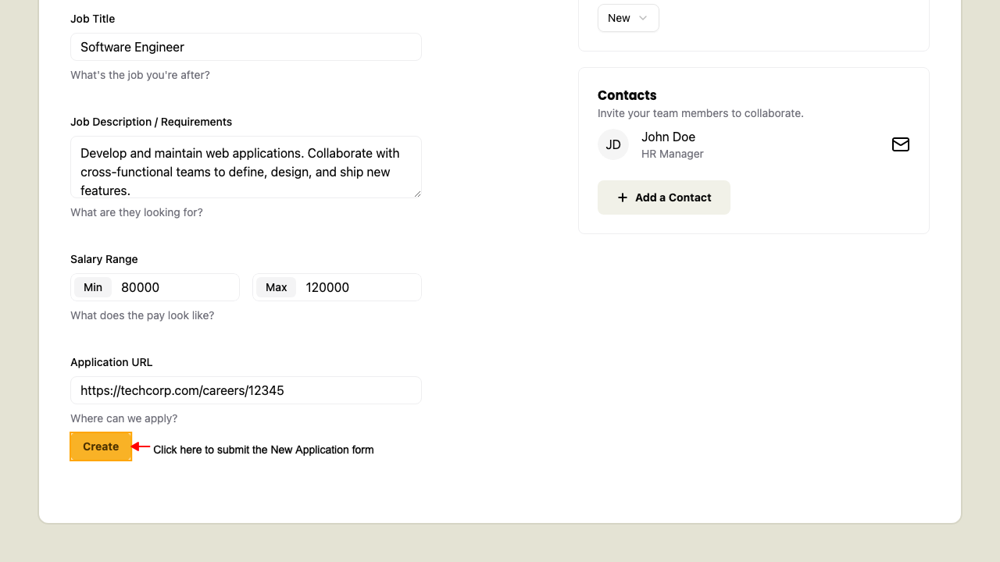
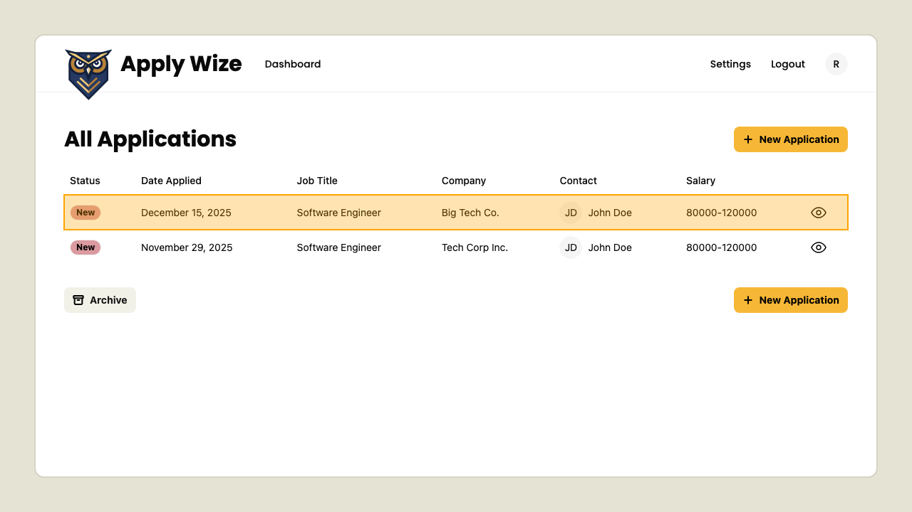
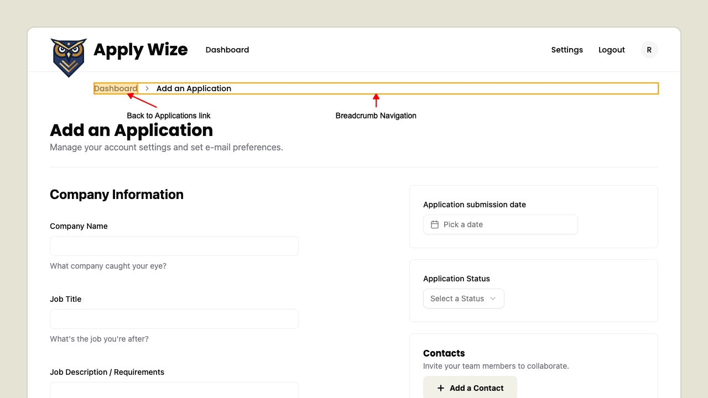

# New Application

## How to add a new Job Application

When on the Applications page, 
click one of the New Application buttons.

 This will navigate to the New Application page.
### Fill out the New Application form.

            On the left side we have:
            - **Company Name**: The company you want to track.
            - **Job Title**: The position you applied for.
            - **Job Description / Requirements**: Key details about the job.
            - **Salary Range**: The minimum and maximum salary for the position.
            - **Application URL**: Link to the job posting or application page.
            

            Right side of the form includes:

            - **Date Applied**: When you submitted your application.
            - **Status**: Current status of your application (e.g., Applied, Interviewing).
            - **Contacts**: People you are in touch with regarding the application.

            #### Setting the Application submission date
            

Click the date button to open the date picker.

Then click a date to select from the date picker.

            Then to dismiss the date picker:
            - Press **Escape** key.
            - Click outside the date picker.
#### Select one of the Application Statuses

Click the Application Statuses button to open the dropdown

Select one of the application statuses from the dropdown:

            - New
            - Applied
            - Interview
            - Rejected
            - Offer
            

#### Add a Contact for the Application
            Open the Add a Contact sheet by clicking the "Add a contact" button.

Enter the contacts information:
            
            - First name
            - Last name
            - Role in the company
            - Email
            

Add the contact by clicking the "Create a Contact" button

Your new contact appears in the Contacts section

Lastly, submit the New Application form by clicking the **Create** button.

This will navigate back to the Applications Dashboard page where we should find our new application listed.

## Breadcrumb Navigation

When on the New Application page, 
click the Breadcrumb link.

 This will navigate back to the Applications Dashboard page.

